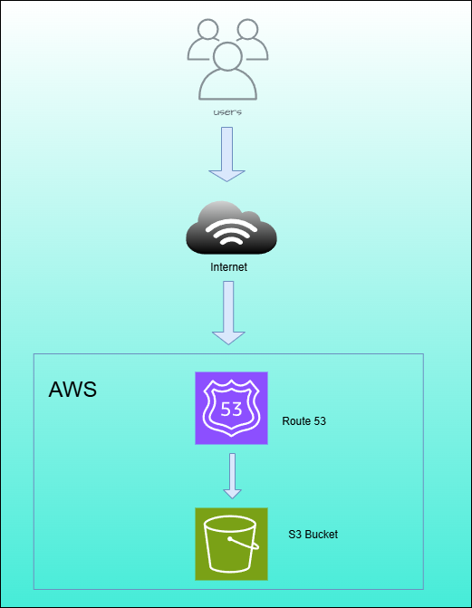

**# AWS Static Website Hosting on S3**

## **Overview**
Amazon S3 (Simple Storage Service) allows users to host static websites without the need for servers. This document describes a simple architecture for hosting a static website using AWS services.

## **Architecture Components**
1. **User**: A visitor accessing the website through a web browser.
2. **Amazon Route 53**: Manages DNS and directs traffic to the S3 bucket.
3. **Amazon S3**: Stores and serves static website content (HTML, CSS, JS, images).

## **Architecture Flow**
1. A user enters the website URL in a browser.
2. Route 53 resolves the domain name and directs traffic to the S3 bucket.
3. The S3 bucket serves the static files to the user.

## **Advantages of Using S3 for Static Hosting**
- **Scalability**: Automatically handles large amounts of traffic.
- **Low Cost**: Only pay for storage and data transfer.
- **High Availability**: Reliable access with AWS’s infrastructure.
- **Security**: IAM policies and bucket permissions ensure controlled access.

## **Basic Setup Steps**
1. **Create an S3 Bucket**: Enable "Static website hosting" in the bucket settings.
2. **Upload Website Files**: Add HTML, CSS, JS, and image files.
3. **Set Permissions**: Update the bucket policy to allow public access (if required).
4. **Configure Route 53**: Point the domain to the S3 bucket.

## **Conclusion**
Hosting a static website on AWS S3 is a simple, scalable, and cost-effective solution. With optional services like Route 53, CloudFront, and ACM, performance and security can be further enhanced.

